# Papazian Archive - Live Product Audit

**Audit date:** July 13, 2026  
**Surfaces reviewed:** [papazian.studio](https://papazian.studio), [papazian-archive.vercel.app](https://papazian-archive.vercel.app), and the local React/TypeScript source  
**Viewports:** 1440 x 1000 desktop and 390 x 844 mobile  
**Modes:** Orbit, Works, Index, Map, Essays, onboarding, filters, map routes, and a project case-study rail

## Executive summary

Papazian Archive already has a distinctive and coherent identity. Its black field, ruled containers, square controls, restrained functional colors, and dense monospace labeling make the “Bureaucratic Brutalist” direction legible across all five modes. Map and Essays are the strongest experiences: both explain their purpose quickly and turn complex material into navigable structures.

The most important gaps are functional rather than cosmetic:

1. Audio can remain indefinitely in “Initializing audio” without recovery.
2. Large wheel/trackpad deltas can move a case-study rail many slides at once and leave its title and slide counter out of sync.
3. Index is a compelling data field on desktop but is not meaningfully scannable on a narrow screen.
4. Essential interface text is often 7-9 px or rendered with low-opacity accent colors, creating a readability and contrast problem.
5. The first-visit guide explains the modes, but it arrives after the visitor has already begun interpreting an unfamiliar spatial interface.

The recommended sequence is to stabilize audio and project navigation first, make Index and the HUD genuinely responsive second, and then perform a focused motion, contrast, asset, and performance polish pass.

## What was verified

- Both production URLs returned successfully and served the same current build during the audit.
- All five navigation modes opened and were exercised on desktop and mobile.
- Index filters, a Map traversal route, the Essays reader, and a case-study rail were tested.
- No browser console warnings or errors appeared during the tested paths.
- `npm run build` and `npm run lint` passed locally.
- The production build still warns about large JavaScript chunks. The largest observed outputs were approximately 709 kB for an app chunk and 508 kB for the Three.js vendor chunk.
- Static generation covers four mode routes, twenty case-study shells, and a 25-URL sitemap.
- The media audit found 419 gallery records and 419 WebP files, with no missing local references in the generated manifest.

This was a targeted product audit, not an exhaustive device-lab or assistive-technology certification. Safari/iOS, Firefox, Android hardware, keyboard-only traversal, screen-reader output, reduced motion, slow networks, and WebGL context-loss recovery should be included in the follow-up verification matrix.

## Visual evidence

### Desktop modes

| Onboarding / Orbit | Works | Index |
| --- | --- | --- |
| 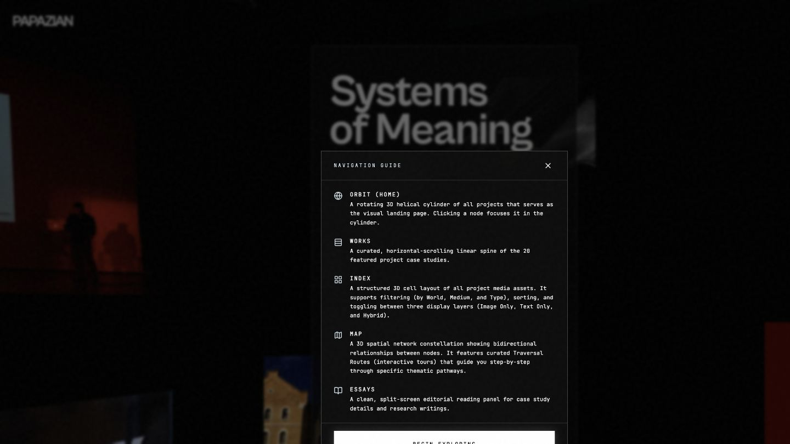 | 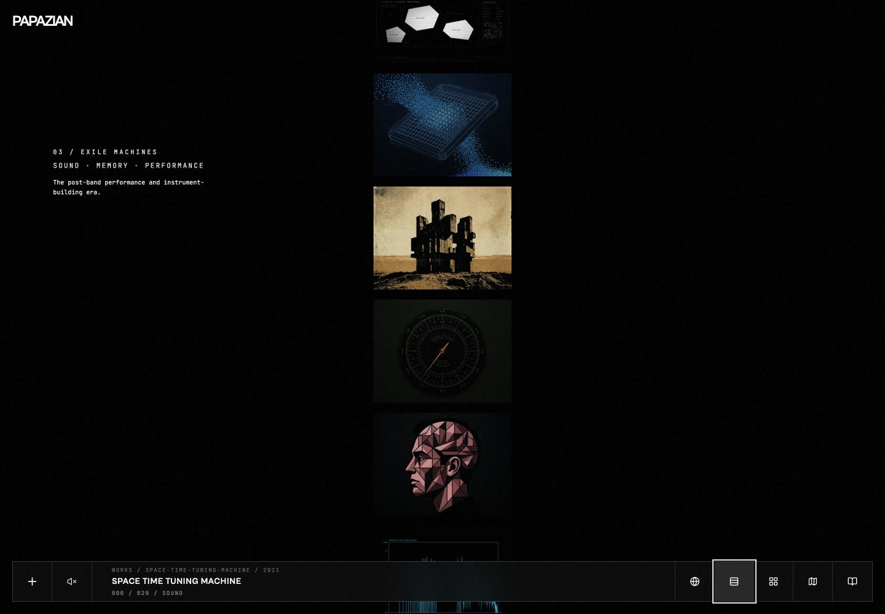 | 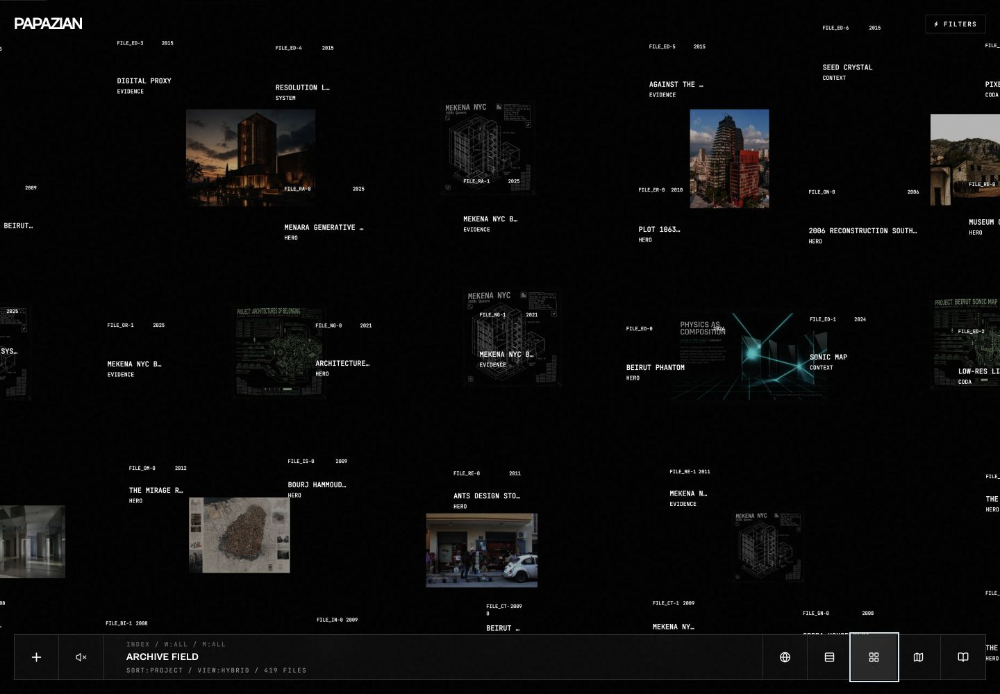 |

| Map traversal | Essays | Project rail |
| --- | --- | --- |
| 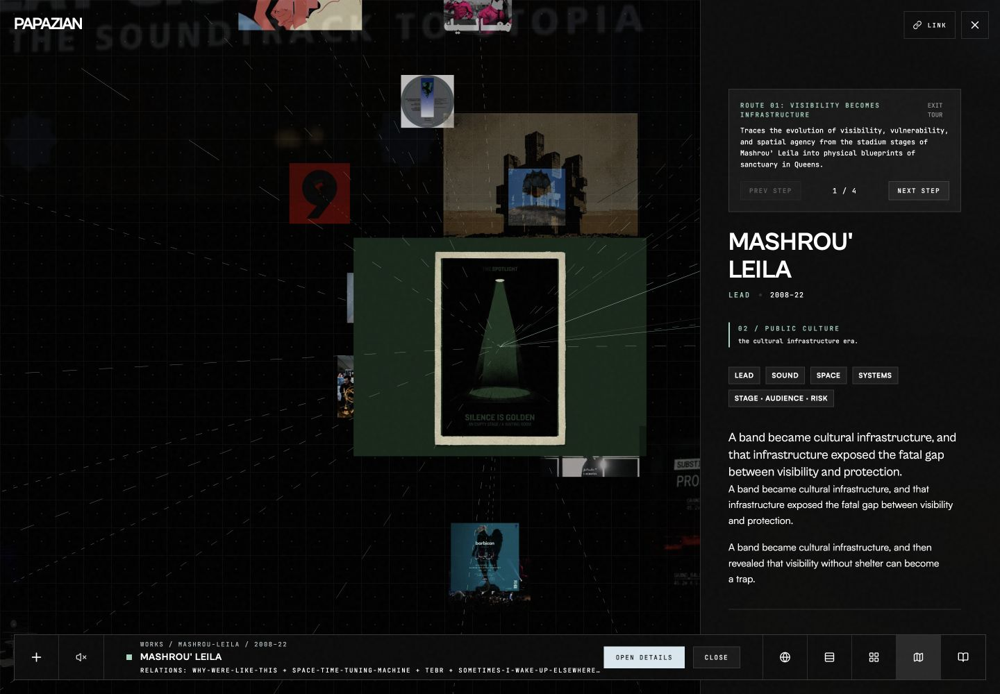 | 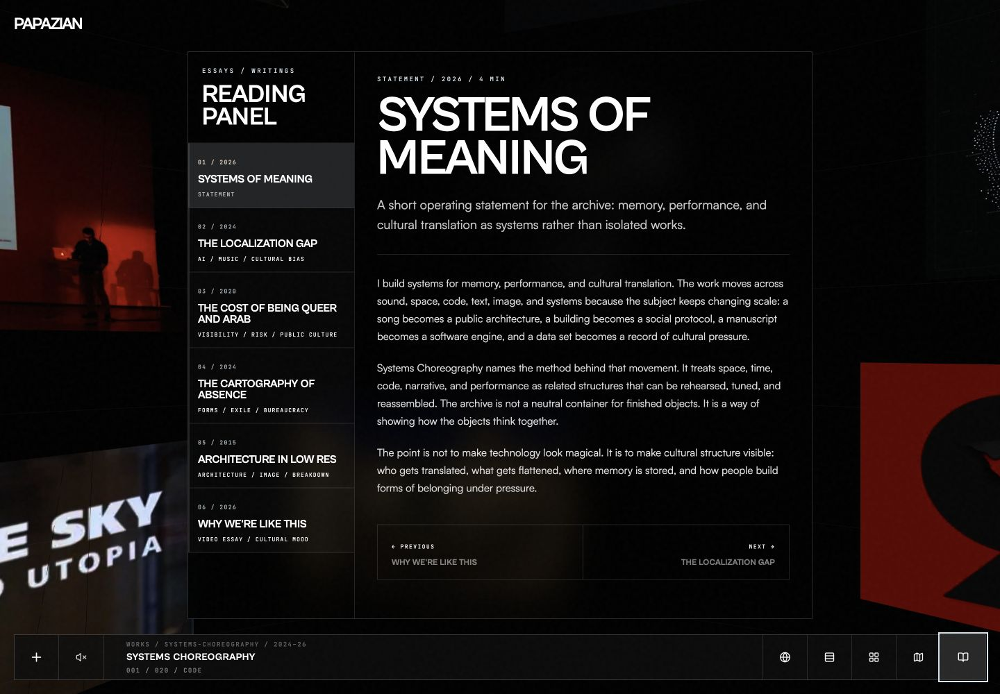 | 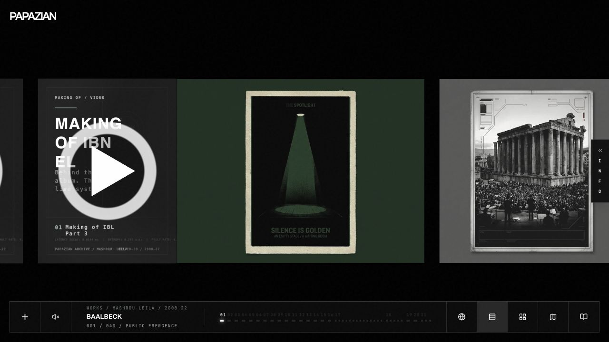 |

### Mobile modes

| Orbit | Works | Index |
| --- | --- | --- |
| 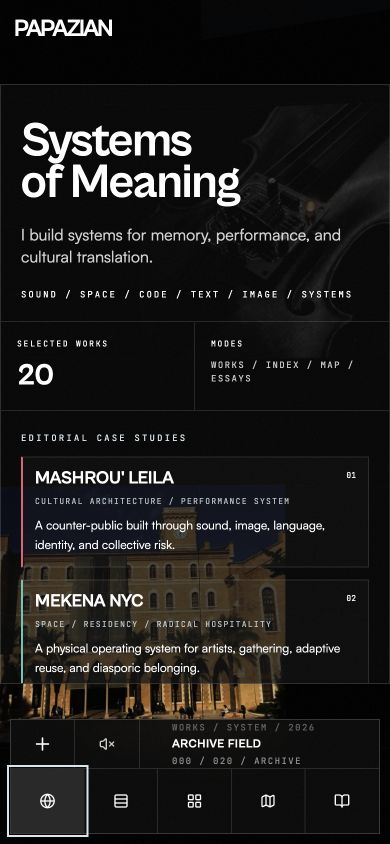 | 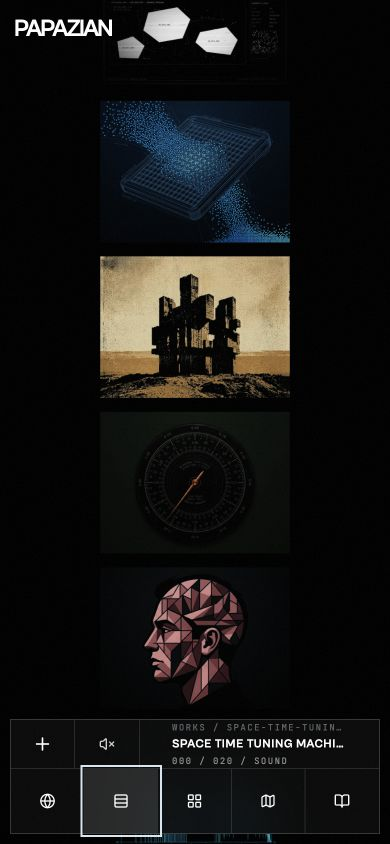 | 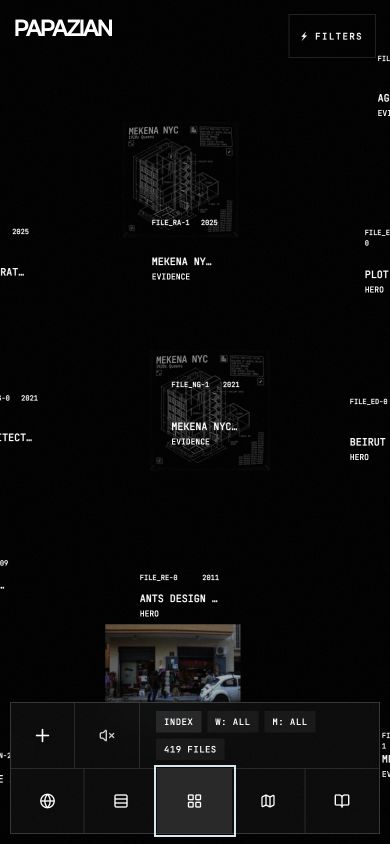 |

| Map tools | Essay reader |
| --- | --- |
| 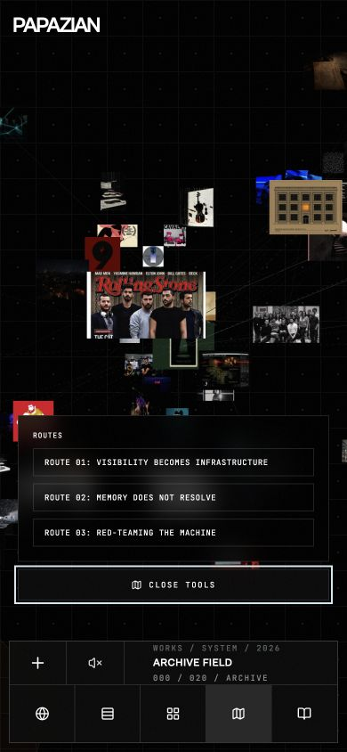 | 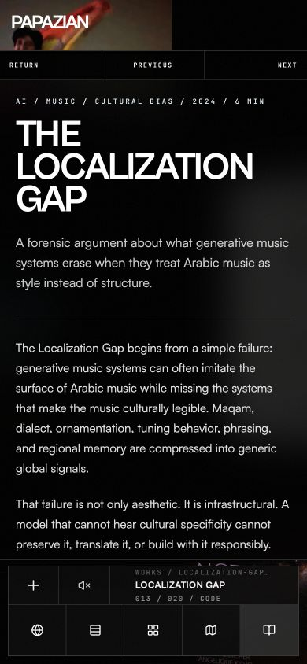 |

### Sprint 2 implementation evidence

| Semantic mobile Index | Sticky archive filters | Mobile artifact detail |
| --- | --- | --- |
| 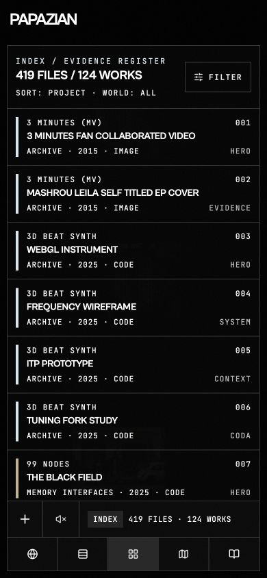 | 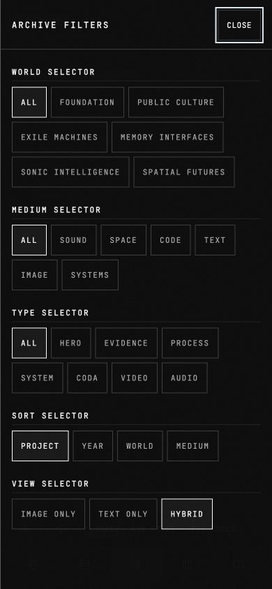 | 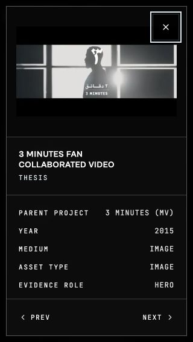 |

| Works context | Safe-area Map tools | Preserved desktop Index |
| --- | --- | --- |
| 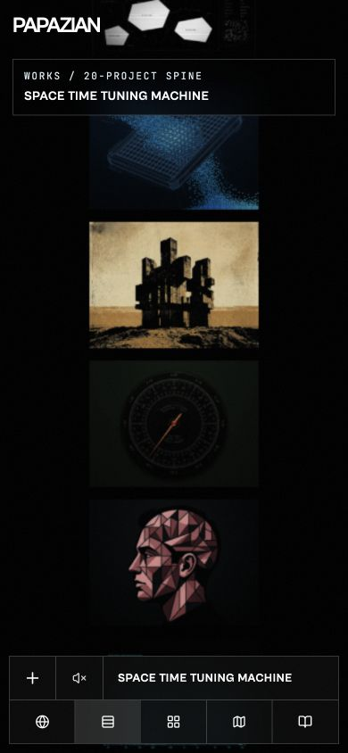 | 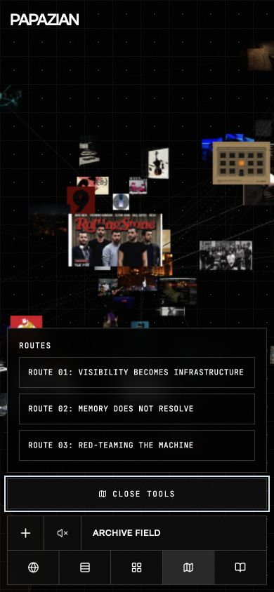 | 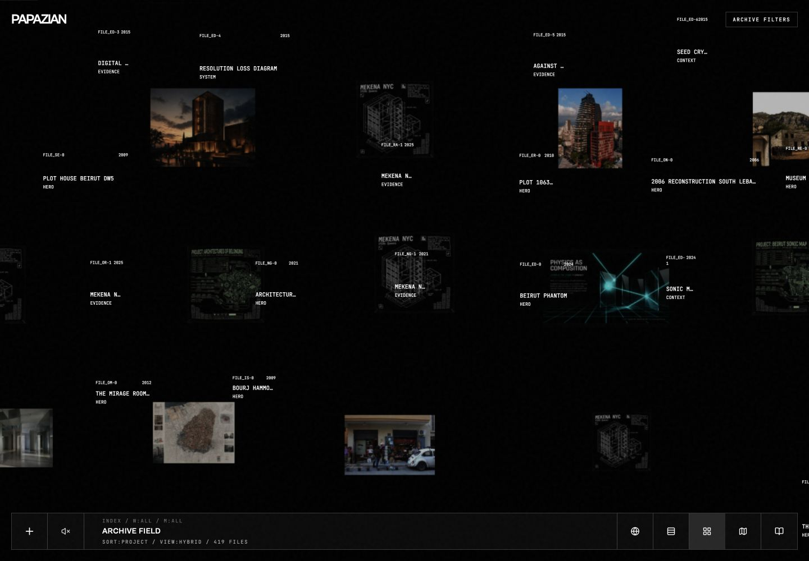 |

## UX and interactive-flow audit

### Navigation between the five modes

The persistent mode switcher is one of the product’s strongest structural decisions. It keeps the archive from feeling like five disconnected prototypes. Active-state styling is clear, and the mode names are concrete enough to learn quickly.

The transition grammar is less consistent. Orbit and Map imply continuous space; Works and Index behave like alternate projections of the same collection; Essays behaves like a separate editorial room. Switching modes currently changes the interface but does not always preserve or explain the visitor’s prior context. A selected project, thematic world, or filter should remain visible when that same concept exists in the destination mode.

Recommended model:

- Orbit -> Works: preserve the selected thematic world and bring the corresponding work into view.
- Works -> Index: preserve the selected project and filter state.
- Index -> Map: preserve the active world/domain filters and highlight matching nodes.
- Map -> Essays: only preserve context when an essay is explicitly related; otherwise reset cleanly.
- Any mode -> project rail -> back: return to the exact prior camera/scroll/filter state.

### First-visit guide

The guide is visually consistent, keyboard-trapped, dismissible by Escape, and uses recognizable icons. Its current 2400 ms delayed appearance is implemented in [`FirstVisitHint.tsx`](../src/components/FirstVisitHint.tsx). That delay lets a visitor see the scene, but it also allows them to begin interacting before the mental model arrives.

A better onboarding pattern is progressive:

1. Show one short, immediate sentence explaining what Orbit is.
2. Point to the five mode controls without blocking the entire interface.
3. Explain drag/scroll/tap only when the visitor first uses a spatial mode.
4. Keep “Replay guide” in an Info or Help surface instead of making dismissal permanent and invisible.

### Interactive console / HUD

The HUD successfully communicates that the archive is an instrument rather than a standard portfolio. On desktop it feels intentional. On mobile it occupies roughly the top 124-132 px and competes with content, especially in Works and Index.

The mobile HUD should become a two-level system:

- Always visible: archive title, current mode, sound, and one menu/control entry.
- Expandable: world legend, explanatory copy, filters, coordinates, and secondary telemetry.

This preserves the institutional console identity without treating a narrow viewport as a scaled-down desktop.

### Project rail and image transitions

Fresh project loads render cleanly and image cards maintain a stable visual rhythm. No obvious image reflow was observed during ordinary slide changes. However, a synthetic 520 px wheel gesture moved a 40-slide rail from its opening slide to approximately slide 37. The visible cards and `037/040` counter updated while the title remained “Baalbeck,” and the mismatch persisted after the motion settled.

Raw deltas are applied in [`ScrollEngine.ts`](../src/core/ScrollEngine.ts), while display state is emitted downstream in [`NodeManager.ts`](../src/core/NodeManager.ts). The rail needs normalized input and one authoritative settled-slide state. Images should also have explicit aspect-ratio metadata so future content changes cannot introduce layout shift.

## Mobile experience audit

### Orbit

Orbit retains its atmosphere on mobile and the primary navigation remains reachable. The primary weakness is discoverability: the canvas does not communicate enough about what is draggable, tappable, or currently selected. Add a transient first-use gesture cue and a persistent compact selected-node caption.

### Works

The visual field survives the narrow viewport, but explanatory context largely disappears. The result is intriguing yet less legible as a portfolio. Keep a one-line mode description and a compact selected-work label above the bottom safe area.

### Index

Index is the main responsive failure. With 419 records, its desktop table becomes tiny, clipped, and difficult to scan on mobile. Horizontal compression should not be the mobile strategy.

Use a semantic list/card row below a narrow breakpoint:

```text
PROJECT / ARTIFACT TITLE
World · Year · Medium
Relation count or one key status
```

Keep sorting and filtering, allow optional horizontal detail expansion, and preserve the dense table only at widths where its columns remain readable.

### Map

Map is strong on mobile once its controls are understood. The tools drawer should use sticky controls, clear scroll boundaries, bottom safe-area padding, and a close affordance that remains visible while the drawer scrolls. Route progress should be announced in text rather than only through line movement.

### Essays

Essays has the best mobile adaptation. The index-to-reader transition is clear and typography is substantially more comfortable than Index. Preserve this pattern as the reference for future narrow-screen overlays and drawers.

## Aesthetic and polish review

### What is working

- The design system is recognizable across all modes without flattening their individual purposes.
- One-pixel rules, black surfaces, square controls, uppercase monospace labels, and restrained world colors form a convincing institutional language.
- Map and Essays achieve the best balance between conceptual density and usability.
- Hover and selected states generally feel functional rather than decorative.
- Project imagery is allowed to carry visual warmth against a controlled interface shell.

### Where consistency breaks down

- Microtype frequently drops to 7-9 px, making essential information feel like texture.
- Some low-opacity accent labels do not meet a comfortable small-text contrast target. For example, a 40% light accent over black computes to roughly 3.1:1; 40% white is roughly 3.7:1.
- Works on mobile loses too much descriptive information, while Index retains too much.
- Filter naming such as “⚡ FILTERS” introduces a different visual voice from the otherwise restrained administrative vocabulary.
- Repeated synthetic thumbnails weaken the credibility of the archive as a carefully catalogued body of evidence.

Recommended type floor:

- 12 px for essential controls and state on mobile.
- 11 px for essential controls on desktop.
- 9-10 px only for nonessential telemetry, with strong contrast and generous tracking.

## Technical findings

### Audio initialization can hang

[`AudioEngine.initialize()`](../src/audio/AudioEngine.ts) dynamically imports Tone.js and audio modes, starts the audio context, and awaits reverb generation. The live control remained at “Initializing audio” for more than ten seconds after a user gesture, without a console error or recovery path. The current promise chain has no timeout.

Implementation direction:

- Race initialization against an 8-10 second timeout.
- Separate import, context start, and impulse generation statuses for diagnostics.
- On timeout or rejection, dispose partially created nodes and expose “Sound unavailable - Retry.”
- Allow a dry audio path if reverb impulse generation is the only failed stage.
- Add a test with a never-resolving `reverb.ready` promise.

### Rail input and state can diverge

[`ScrollEngine.ts`](../src/core/ScrollEngine.ts) multiplies raw wheel and pointer deltas directly. Hardware and browser delta magnitudes vary widely, so one physical gesture can represent many logical slides. The title/counter mismatch suggests visual position and metadata derive from different intermediate states.

Implementation direction:

- Normalize wheel `deltaMode` and clamp maximum delta per frame.
- Accumulate input into a bounded target, then snap to one slide index after inactivity.
- Drive title, counter, URL, and active card from the same settled index.
- Abort stale animation callbacks when a new target is chosen.
- Test mouse wheel, precision trackpad, keyboard arrows, touch flick, and a 500+ px synthetic delta.

### Bundle and fallback resilience

The build is healthy but heavy for an experience whose first screen depends on Three.js. Manual chunking exists, yet the main app and Three.js chunks remain large. The React error boundary reports a failure, but there is no meaningful HTML-only archive when WebGL is unavailable.

Implementation direction:

- Load Map/project-specific code only on entry to those modes.
- Delay Tone.js until the first explicit sound action.
- Establish a compressed-size budget in CI and report regressions.
- Render an HTML collection/essay fallback when WebGL creation fails or context loss is unrecoverable.
- Add context-loss telemetry without recording visitor-identifying data.

### Asset integrity

The local manifest is internally complete, but the synthetic-image fallback in [`atlas.ts`](../src/data/atlas.ts) assigns `/images/atlas/meaning-stack-github-constellation.webp` to any unmapped synthetic node. At least `meaning-stack`, `chronocumulator`, and `99-nodes` therefore present the same thumbnail.

Implementation direction:

- Require explicit hero/thumbnail media for every canonical project.
- Add width, height, and aspect ratio to the manifest.
- Fail the content check when multiple canonical projects unintentionally share a hero image.
- Keep a deliberate neutral placeholder only for genuinely unillustrated records, and label that state in metadata.

### SEO and deployment

The root, mode routes, canonical URLs, robots file, sitemap, and project shells are in good shape for a Vite/WebGL experience. The next improvement is richer per-project meaning rather than more generic tags.

Implementation direction:

- Add `WebSite` and `CollectionPage` structured data at archive level.
- Add `CreativeWork` structured data for project pages.
- Generate unique descriptions and social images from canonical project metadata.
- Add an automated check for title, description, canonical, Open Graph image, and image alt text.
- Upgrade the local Vercel CLI from 54.20.1 to 55.0.0 with `npm i -g vercel@latest` or `pnpm add -g vercel@latest` before future deployment work.

## Prioritized implementation roadmap

### P0 - Critical bug fixes

- [x] Add an audio initialization timeout, partial cleanup, visible failure state, and retry action in `AudioEngine` and the sound control.
- [x] Add unit coverage for rejected and never-resolving Tone.js initialization stages.
- [x] Normalize and clamp rail input across wheel, trackpad, touch, pointer, and keyboard input.
- [x] Make settled slide index the single source of truth for card position, title, counter, and route state.
- [x] Add a regression test using a 500+ px wheel delta and assert that metadata matches the visible slide after settling.

**P0 acceptance:** audio always reaches ready or recoverable error within ten seconds; a single gesture cannot silently traverse most of a rail; rail title and counter always match the visible active slide.

### P1 - Responsive adjustments

- [x] Replace the compressed mobile Index table with semantic list rows while retaining sort and filter behavior.
- [x] Reduce the mobile HUD to primary controls and move secondary telemetry into an expandable panel.
- [x] Restore a one-line purpose statement and selected-work caption in mobile Works.
- [x] Keep drawer close buttons and primary actions sticky during scrolling.
- [x] Apply bottom safe-area padding to Map tools, filters, essay reader, and project controls.
- [x] Verify 320, 360, 390, 430, 768, 1024, and 1440 px widths, plus landscape mobile.

**P1 acceptance:** no essential text is clipped; every drawer can be closed at any scroll position; Index records are readable without browser zoom; primary content is not hidden by the HUD or device safe areas.

### P1 - Accessibility and readability

- [x] Raise essential UI text to at least 11 px desktop and 12 px mobile.
- [x] Replace low-opacity essential text colors with higher-contrast semantic tokens and stronger control boundaries.
- [x] Add a searchable HTML list/detail counterpart for canvas-only selectable content.
- [x] Announce mode, selected node, route step, filter result count, and slide changes through a restrained live region.
- [x] Verify keyboard containment, focus return, focus visibility, 200% reflow, and reduced-motion implementation in the local browser/code pass.
- [ ] Complete manual VoiceOver and NVDA certification on representative desktop and mobile hardware.
- [x] Ensure icon-only buttons have stable accessible names and at least 44 x 44 px mobile targets.

### P2 - Navigation and onboarding

- [x] Replace the delayed blocking guide with progressive, contextual first-use guidance.
- [x] Add a persistent “Replay guide” entry.
- [x] Preserve selected project, world, and relevant filters across compatible mode transitions.
- [x] Restore exact camera/scroll/filter context when leaving and returning from a project.
- [x] Define a consistent transition grammar for spatial-to-spatial, collection-to-collection, and editorial transitions.
- [x] Rename “⚡ FILTERS” using the archive’s established administrative language.

### P2 - Interactive micro-animations

- [x] Use one shared duration/easing token set for mode changes, drawers, selections, and project settling.
- [x] Animate selection state from the prior object/location instead of fading unrelated screens through black.
- [x] Add a subtle first-use gesture cue in Orbit and Map, then retire it permanently after use.
- [x] Provide reduced-motion alternatives that preserve state clarity without camera travel or large transforms.
- [x] Prevent stale motion callbacks from updating labels after a newer selection.

**Sprint 3 verification — July 13, 2026:** live browser QA confirmed the immediate two-step guide, Info-console replay, one-time Orbit and Map gesture cues, directional mode labels, and a single polite status announcement. A scrolled Works view returned from a 16-slide case study to the same visible card stack. Project context persisted in the URL and HUD from Works to Index to Map; Index world/medium filters remained in the URL and highlighted the matching Map subset. Mobile Index exposes the carried project, including an explicit “outside active filter” state, at 320 and 390 px without horizontal overflow. Route progress announced steps 1 and 2 of 5, and the browser console reported no warnings or errors. This does not replace VoiceOver, NVDA, or physical-device reduced-motion certification.

**Accessibility closeout verification — July 13, 2026:** removed the hidden focus-proxy dashboard that inserted more than one hundred off-screen project controls into the tab order and replaced it with an explicit searchable text archive. Browser QA confirmed 13 visible focus stops on Home, skip-navigation targeting, trapped focus and focus return in the information console, native text-dialog focus, zero essential text below 11 px desktop or 12 px mobile, no horizontal overflow at 640, 390, or 320 px, and no sub-44 px visible controls at 390 px. The 320 px text archive retained independent list/detail scrolling, a 44 px search field and close control, and no browser warnings. Selecting Mashrou' Leila from search closed the dialog and handed off to Works with `#context=mashrou-leila&mode=vertical`. `MotionConfig` and CSS/Three.js reduced-motion paths were inspected, but VoiceOver, NVDA, physical-device zoom, and OS-level reduced-motion behavior remain manual certification items.

### P2 - Performance and resilience

- [x] Split Map, project-rail, and editorial UI at mode boundaries.
- [x] Defer Tone.js and all audio-mode imports until explicit sound activation.
- [x] Add compressed JavaScript, entry-chunk, and per-chunk budgets to the production build.
- [x] Supply a useful searchable HTML archive fallback for missing WebGL, explicit text-only use, or unrecoverable initialization failure.
- [x] Test on a throttled mid-tier mobile profile and record interaction latency, memory, and context-loss behavior.
- [x] Avoid eager loading full-resolution project imagery outside the active/adjacent rail window.

**Delivery-hardening verification — July 13, 2026:** the main entry fell from 730 KB to 266 KB raw after separating Scene/Three.js, Overlay, onboarding, media viewers, generated archive content, and shared interface libraries. Tone.js remains a 340 KB user-gesture-only dynamic chunk. The production verifier now enforces a 600 KB per-chunk ceiling, 450 KB entry ceiling, 560 KB total-JavaScript gzip ceiling, deferred Tone.js, no Node.js browser shims, complete static routes, structured metadata, sitemap parity, and media-manifest coverage. The verified build contains 19 JavaScript chunks totaling 447.1 KB gzip across all eager and lazy code.

**Sprint 5 performance verification — July 13, 2026:** the spatial loop now yields the initial semantic paint, caps constrained/coarse-pointer devices at 30 fps (24 fps for reduced motion), pauses work while the document is hidden, and no longer recomputes relation geometry and guide-line state twice per frame. Under Lighthouse mobile CPU/network throttling, total blocking time fell from 5.51 s to 0.88–1.02 s, main-thread work fell from 20.4 s to 5.8 s, LCP improved from 7.3 s to 4.4 s, CLS remained 0, and accessibility, best-practices, and SEO remained 100 with no console errors. Software WebGL renderers now receive the complete semantic archive rather than a main-thread-locking 3D field. Browser QA on the accelerated production preview confirmed all five mode routes, the lazy Essays reader, a 390 px Index with 419 keyboard-reachable records, independent momentum scrolling, no horizontal overflow, a usable inspector close control, and a 20-link canvas-free text fallback. A forced `WEBGL_lose_context` cycle displayed the recovery state, restored the existing canvas, cleared the state, and produced no errors; removing a redundant renderer remount also eliminated 180 invalid-resource cleanup warnings. Physical-device memory-pressure telemetry remains a device-level certification item.

**Mode-boundary verification — July 13, 2026:** Map tools (4.85 KB raw), project-rail details (3.66 KB raw), and Essays (11.57 KB raw) now compile as separate lazy chunks. A cold Home load requested none of them; direct Map, case-study, and Essays routes requested only their corresponding mode chunk. Desktop and 390 px browser passes confirmed three Map routes, route activation, expanded rail metadata, no horizontal overflow, and no console errors. Overlay fell from 72.61 KB to 65.46 KB raw while retaining route and selection state in the parent boundary.

### P2 - Asset and content-system improvements

- [x] Replace shared fallback thumbnails for canonical projects and enforce duplicate-primary detection in the generated manifest.
- [x] Define one canonical media field for every project and generate all mode-specific derivatives from it.
- [x] Store intrinsic image dimensions, aspect ratios, byte size, role, status, and digest in the generated media manifest.
- [x] Add content validation for missing media, duplicate heroes, malformed alt text, and noncanonical file paths.
- [x] Reserve and render image space before decode to guarantee layout stability.

### P3 - SEO and metadata enhancements

- [x] Add archive-level `WebSite` and `CollectionPage` structured data.
- [x] Add per-project `CreativeWork` structured data.
- [x] Generate distinct descriptions, Open Graph images, and alt text for every canonical project.
- [x] Add metadata and sitemap assertions to the production build.
- [x] Confirm that the HTML fallback exposes meaningful project links to crawlers and non-WebGL visitors.

## Recommended delivery sequence

### Sprint 1 - Stabilize the instrument

Complete all P0 work, add regression tests, and verify the five modes on desktop and mobile. Do not begin broad visual redesign until audio and rail state are reliable.

### Sprint 2 - Make mobile intentional

Implement the responsive Index, compact HUD, sticky drawer controls, safe-area handling, and type/contrast floors. Use the existing Essays mobile pattern as the interaction reference.

### Sprint 3 - Connect the archive

Preserve context between modes, improve onboarding, unify transition motion, and make selected-state announcements accessible.

### Sprint 4 - Harden delivery

Close the remaining accessibility certification first, then split heavy mode code, defer audio, add the HTML fallback, establish bundle/content checks, replace duplicate canonical imagery, and complete structured metadata.

**Sprint 5 status:** the canonical media pipeline, reserved image geometry, social/alt metadata validation, unified motion system, throttled-device pass, Map/project-rail/editorial mode boundaries, and forced WebGL recovery cycle are complete. Remaining release-certification work is manual VoiceOver, NVDA, physical-device zoom/reduced-motion, and memory-pressure testing.

## Definition of done

The enhancement pass is complete when:

- Audio always resolves to ready or a retryable error.
- A project rail cannot display conflicting title, counter, and active imagery.
- Index is usable at 320 px without zoom or clipped essential content.
- All essential controls meet target size, contrast, focus, and accessible-name requirements.
- Mode changes preserve relevant context and back-navigation restores the prior state.
- Reduced-motion and non-WebGL visitors retain a meaningful archive experience.
- Canonical projects have unique validated media and metadata.
- Build, lint, automated interaction tests, metadata checks, and the agreed device matrix pass.
